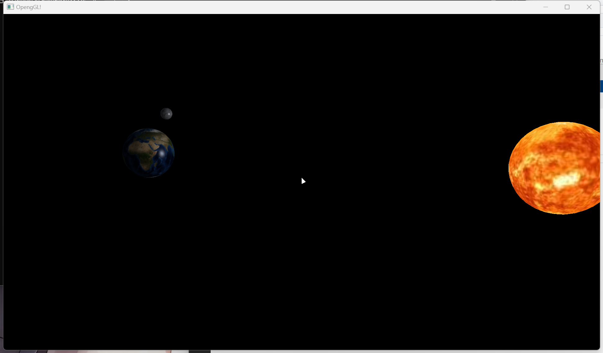
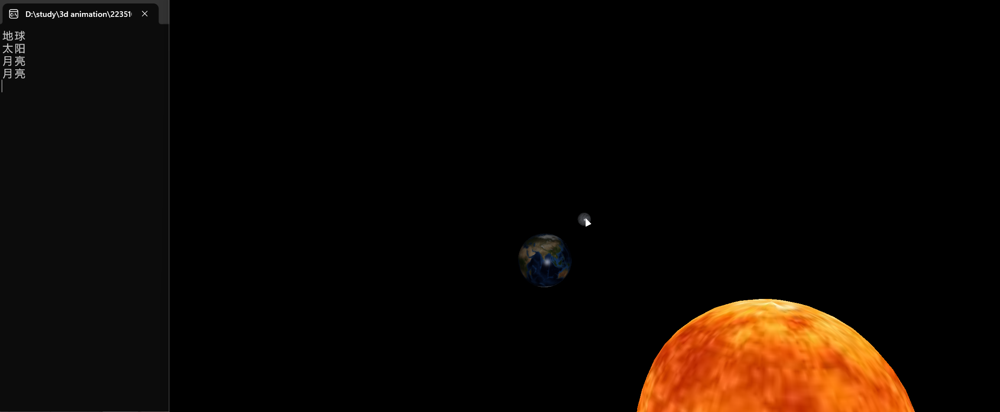
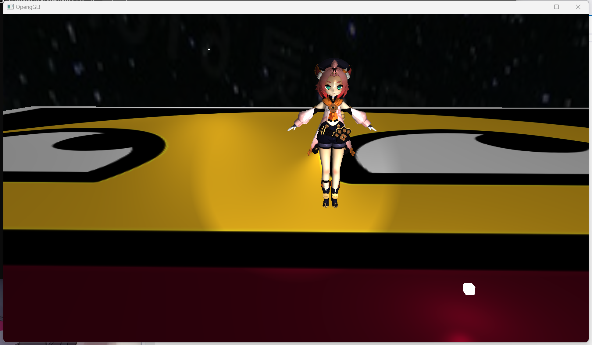

#课程作业和Siggraph今年一篇论文的读书报告

作业一.三角形的显示

作业二.日地月模型的显示和点击输出名称
    模型的显示
    
    点击输出名称
    

作业三.模型的读取、多光源渲染、相机切换和模型操作
    ·操作：
        相机：WSADQE相机上下左右移动，按住鼠标左键后鼠标移动镜头，滚轮可以拉近推远视角
        切换：点按F键切换自由相机视角和模型相机视角
        模型操作：模型相机视角下WSADQE上下左右前后移动模型，上下方向键缩放模型，左右以世界空间z轴旋转模型
    模型读取和渲染效果
    
