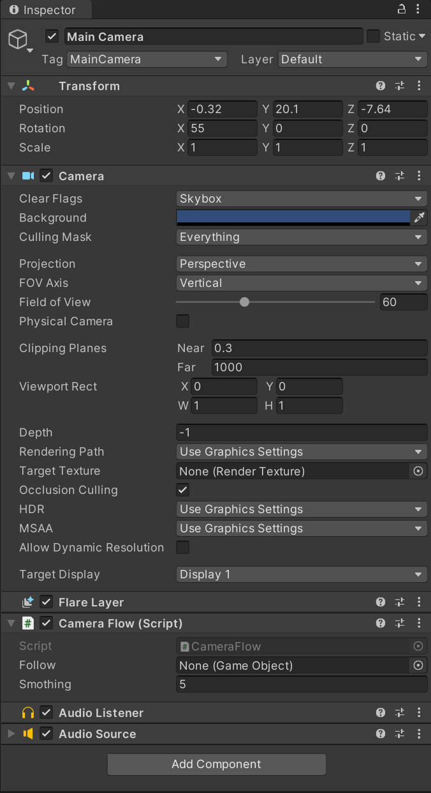
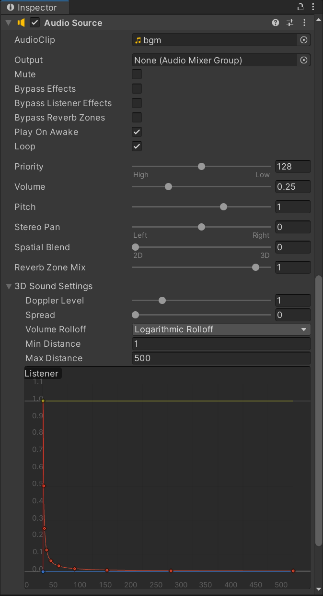
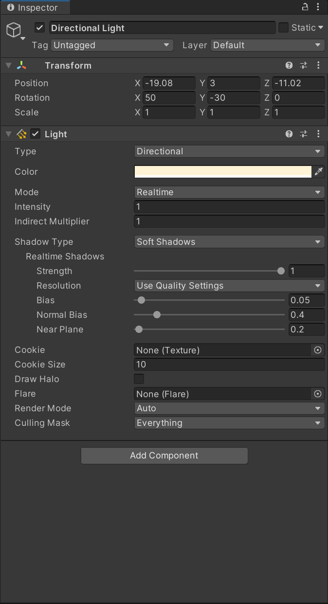
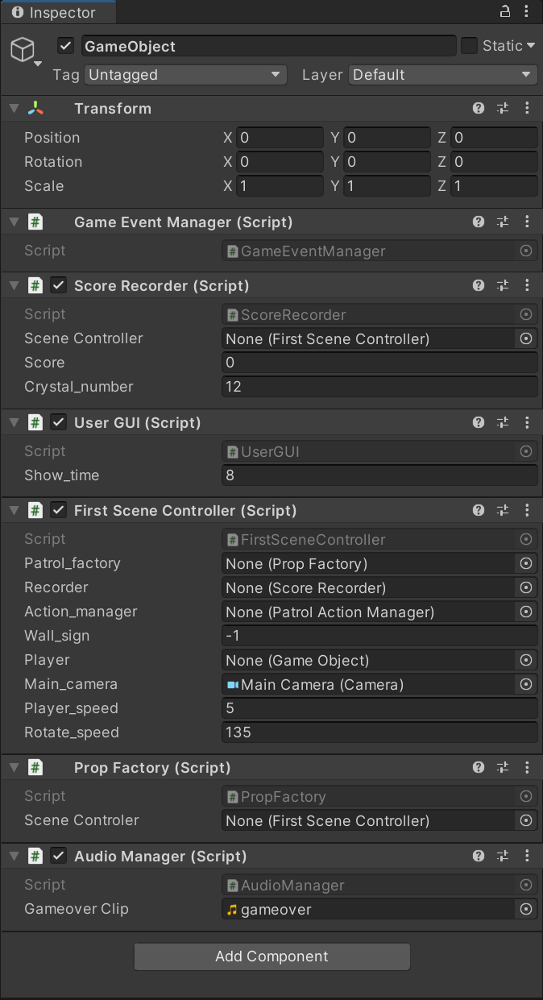
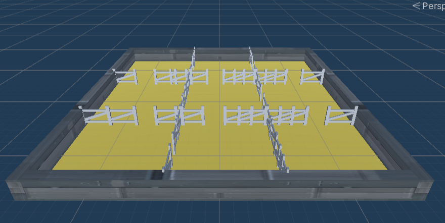
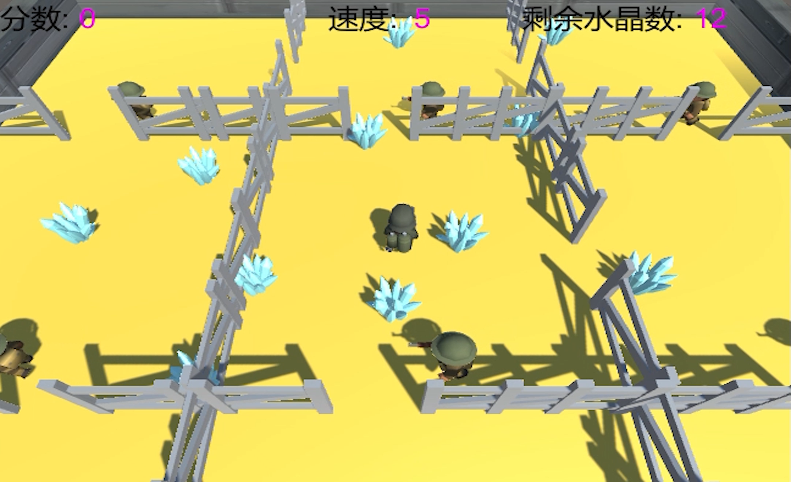
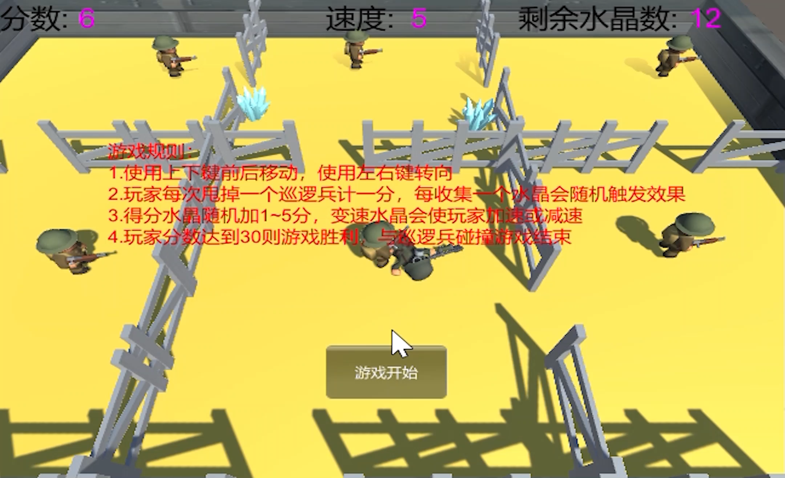
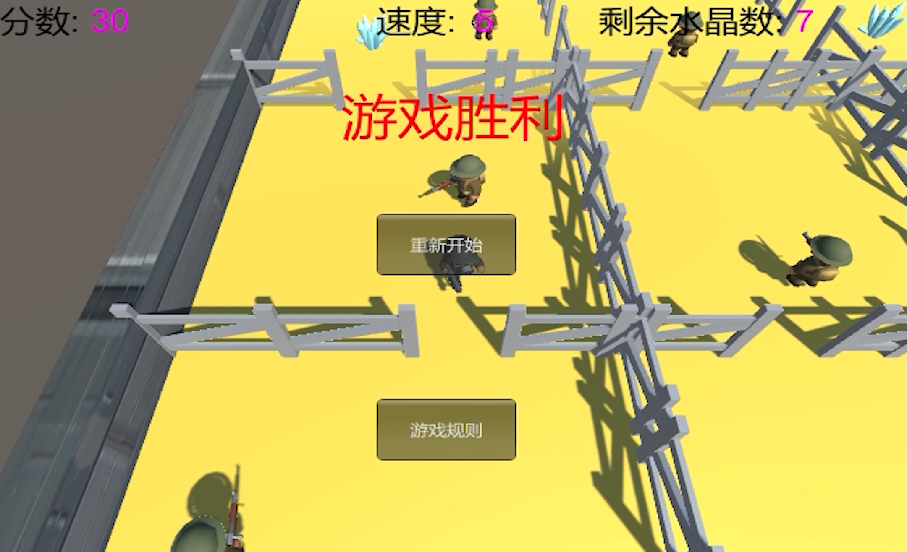
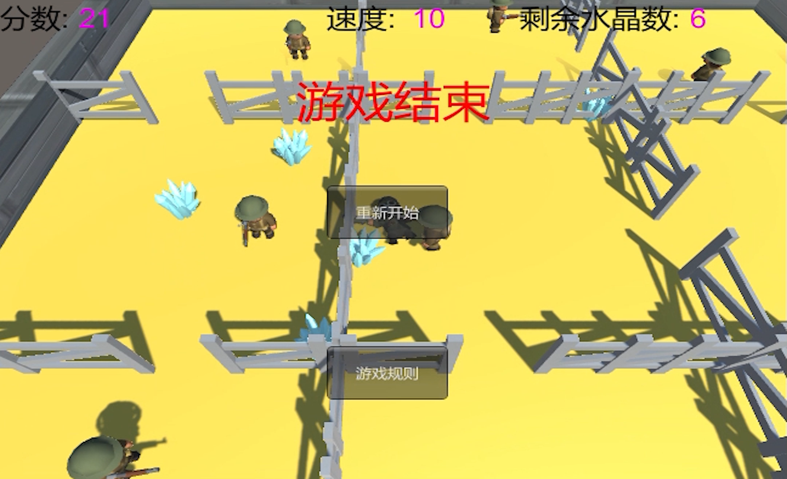

# 使用Unity和C#开发的巡逻兵小游戏
## 项目配置
+ 新建项目，将Assets文件替换为我项目中的Assets文件，Assets/Scenes/中的myScene是本次游戏场景，直接拖入左栏Hierarchy再remove掉原来存在的Untitled即可运行游戏
+ Main Camera配置如下：

    

    
+ Directional Light配置如下：

    
+ 新建一个GameObject，配置如下：

    
## 核心算法分析
UML类图如下：


### 订阅与发布模式
涉及到的类有：PlayerCollide、SSActionManager、CrystalCollide、FirstSceneController、GameEventManager。明星(PlayerCollide、SSActionManager、CrystalCollide)负责检测玩家触发的事件，并交由公众号(GameEventManager)发布，粉丝(FirstSceneController)订阅了公众号(GameEventManager)负责发布的事件，并且为这些事件注册了相应的方法。明星发布消息给公众号说明事件被触发，公众号检查粉丝是否订阅此事件，若是就通知粉丝该事件被触发，然后粉丝就会调用对应的方法。

PlayerCollide：检测玩家和巡逻兵碰撞事件，巡逻兵身上的碰撞器触碰到玩家的碰撞器将会使游戏结束，并且各自播放对应动画，具体代码实现如下：
```
public class PlayerCollide : MonoBehaviour 
{

    void OnCollisionEnter(Collision other)
    {
        //当玩家与巡逻兵相撞
        if (other.gameObject.tag == "Player")
        {
            other.gameObject.GetComponent<Animator>().SetTrigger("death");
            this.GetComponent<Animator>().SetTrigger("shoot");
            //游戏结束，发布消息
            Singleton<GameEventManager>.Instance.PlayerGameover();
        }
    }
}
```
SSActionManager：在SSActionEvent函数中检测玩家摆脱巡逻兵事件，当玩家逃离巡逻兵触发器的范围的时候，分数会增加，具体代码实现如下：
```
public void SSActionEvent(SSAction source, int intParam = 0, GameObject objectParam = null)
{
    if(intParam == 0)
    {
        //侦查兵跟随玩家
        PatrolFollowAction follow = PatrolFollowAction.GetSSAction(objectParam.gameObject.GetComponent<PatrolData>().player);
        this.RunAction(objectParam, follow, this);
    }
    else
    {
        //侦察兵按照初始位置开始继续巡逻
        GoPatrolAction move = GoPatrolAction.GetSSAction(objectParam.gameObject.GetComponent<PatrolData>().start_position);
        this.RunAction(objectParam, move, this);
        //玩家逃脱，发布消息
        Singleton<GameEventManager>.Instance.PlayerEscape();
    }
}
```
CrystalCollide：检测玩家收集水晶事件，当玩家触碰到水晶的时候，水晶消失，水晶数量减少，具体代码实现如下：
```
public class CrystalCollide : MonoBehaviour 
{

    void OnTriggerEnter(Collider collider)
    {
        if (collider.gameObject.tag == "Player" && this.gameObject.activeSelf)
        {
            this.gameObject.SetActive(false);
            //减少水晶数量，发布消息
            Singleton<GameEventManager>.Instance.ReduceCrystalNum();
        }
    }
}
```
FirstSceneController：场景控制器作为订阅者，相关代码如下：
```
void OnEnable()
{
    //注册事件
    GameEventManager.ScoreChange += AddScore;
    GameEventManager.GameoverChange += Gameover;
    GameEventManager.CrystalChange += ReduceCrystalNumber;
}
void OnDisable()
{
    //取消注册事件
    GameEventManager.ScoreChange -= AddScore;
    GameEventManager.GameoverChange -= Gameover;
    GameEventManager.CrystalChange -= ReduceCrystalNumber;
}
void ReduceCrystalNumber()
{
    recorder.ReduceCrystal();
}
void AddScore()
{
    recorder.AddScore();
}
void Gameover()
{
    game_over = true;
    patrol_factory.StopPatrol();
    action_manager.DestroyAllAction();
}
```
GameEventManager：发布事件的类，具体代码实现如下：
```
public class GameEventManager : MonoBehaviour
{
    //分数变化
    public delegate void ScoreEvent();
    public static event ScoreEvent ScoreChange;
    //游戏结束变化
    public delegate void GameoverEvent();
    public static event GameoverEvent GameoverChange;
    //水晶数量变化
    public delegate void CrystalEvent();
    public static event CrystalEvent CrystalChange;

    //玩家逃脱
    public void PlayerEscape()
    {
        if (ScoreChange != null)
        {
            ScoreChange();
        }
    }
    //玩家被捕
    public void PlayerGameover()
    {
        if (GameoverChange != null)
        {
            GameoverChange();
        }
    }
    //减少水晶数量
    public void ReduceCrystalNum()
    {
        if (CrystalChange != null)
        {
            CrystalChange();
        }
    }
}
```
### 巡逻兵
巡逻兵部分实现了进行矩形路线的自动巡逻移动，当玩家进入它的触发器范围后，如果玩家当前在自己巡逻区域内，则跟随追捕玩家。如果巡逻兵与玩家碰撞，则双方都播放碰撞后动画，游戏结束。为巡逻兵添加两个Collider，一个是Capsule Collider，添加在预制体父节点上，用于检测巡逻兵与玩家的碰撞。另一个是Box Collider，添加在预制体的子节点上，用于检测玩家进入巡逻兵巡逻的范围。

PatrolData：保存巡逻兵基本数据的类，具体代码实现如下：
```
public class PatrolData : MonoBehaviour
{
    public int sign;                      //标志巡逻兵在哪一块区域
    public bool follow_player = false;    //是否跟随玩家
    public int wall_sign = -1;            //当前玩家所在区域标志
    public GameObject player;             //玩家游戏对象
    public Vector3 start_position;        //当前巡逻兵初始位置     
}
```
PropFactory:工厂模式生产巡逻兵，相关代码实现如下：
```
public List<GameObject> GetPatrols()
{
    int[] pos_x = { -6, 4, 13 };
    int[] pos_z = { -4, 6, -13 };
    int index = 0;
    //生成不同的巡逻兵初始位置
    for(int i=0;i < 3;i++)
    {
        for(int j=0;j < 3;j++)
        {
            vec[index] = new Vector3(pos_x[i], 0, pos_z[j]);
            index++;
        }
    }
    for(int i=0; i < 9; i++)
    {
        patrol = Instantiate(Resources.Load<GameObject>("Prefabs/Patrol"));
        patrol.transform.position = vec[i];
        patrol.GetComponent<PatrolData>().sign = i + 1;
        patrol.GetComponent<PatrolData>().start_position = vec[i];
        used.Add(patrol);
    }   
    return used;
}
public void StopPatrol()
{
    //切换所有巡逻兵的动画
    for (int i = 0; i < used.Count; i++)
    {
        used[i].gameObject.GetComponent<Animator>().SetBool("run", false);
    }
}
```
GoPatrolAction：实现巡逻兵巡逻的动作，根据四个方向来选择要去到的目的地，当当前位置与目的地相差0.9f的时候，换一个方向继续巡逻，具体代码实现如下：
```
public class GoPatrolAction : SSAction
{
    private enum Dirction { EAST, NORTH, WEST, SOUTH };
    private float pos_x, pos_z;                 //移动前的初始x和z方向坐标
    private float move_length;                  //移动的长度
    private float move_speed = 1.2f;            //移动速度
    private bool move_sign = true;              //是否到达目的地
    private Dirction dirction = Dirction.EAST;  //移动的方向
    private PatrolData data;                    //巡逻兵的数据


    private GoPatrolAction() { }
    public static GoPatrolAction GetSSAction(Vector3 location)
    {
        GoPatrolAction action = CreateInstance<GoPatrolAction>();
        action.pos_x = location.x;
        action.pos_z = location.z;
        //设定移动矩形的边长
        action.move_length = Random.Range(4, 7);
        return action;
    }
    public override void Update()
    {
        //防止碰撞发生后的旋转
        if (transform.localEulerAngles.x != 0 || transform.localEulerAngles.z != 0)
        {
            transform.localEulerAngles = new Vector3(0, transform.localEulerAngles.y, 0);
        }            
        if (transform.position.y != 0)
        {
            transform.position = new Vector3(transform.position.x, 0, transform.position.z);
        }
        //巡逻兵移动
        Gopatrol();
        //如果巡逻兵需要跟随玩家并且玩家就在侦察兵所在的区域，侦查动作结束
        if (data.follow_player && data.wall_sign == data.sign)
        {
            this.destroy = true;
            this.callback.SSActionEvent(this,0,this.gameobject);
        }
    }
    public override void Start()
    {
        this.gameobject.GetComponent<Animator>().SetBool("run", true);
        data  = this.gameobject.GetComponent<PatrolData>();
    }

    void Gopatrol()
    {
        if (move_sign)
        {
            //不需要转向则设定一个目的地，按照矩形移动
            switch (dirction)
            {
                case Dirction.EAST:
                    pos_x -= move_length;
                    break;
                case Dirction.NORTH:
                    pos_z += move_length;
                    break;
                case Dirction.WEST:
                    pos_x += move_length;
                    break;
                case Dirction.SOUTH:
                    pos_z -= move_length;
                    break;
            }
            move_sign = false;
        }
        this.transform.LookAt(new Vector3(pos_x, 0, pos_z));
        float distance = Vector3.Distance(transform.position, new Vector3(pos_x, 0, pos_z));
        //当前位置与目的地距离浮点数的比较
        if (distance > 0.9)
        {
            transform.position = Vector3.MoveTowards(this.transform.position, new Vector3(pos_x, 0, pos_z), move_speed * Time.deltaTime);
        }
        else
        {
            dirction = dirction + 1;
            if(dirction > Dirction.SOUTH)
            {
                dirction = Dirction.EAST;
            }
            move_sign = true;
        }
    }
}
```
PatrolFollowAction：实现巡逻兵追捕玩家的动作，当玩家走出巡逻兵触发器的范围或是玩家走出此巡逻兵所在区域则停止追捕，具体代码实现如下：
```
public class PatrolFollowAction : SSAction
{
    private float speed = 2f;            //跟随玩家的速度
    private GameObject player;           //玩家
    private PatrolData data;             //侦查兵数据

    private PatrolFollowAction() { }
    public static PatrolFollowAction GetSSAction(GameObject player)
    {
        PatrolFollowAction action = CreateInstance<PatrolFollowAction>();
        action.player = player;
        return action;
    }

    public override void Update()
    {
        if (transform.localEulerAngles.x != 0 || transform.localEulerAngles.z != 0)
        {
            transform.localEulerAngles = new Vector3(0, transform.localEulerAngles.y, 0);
        }
        if (transform.position.y != 0)
        {
            transform.position = new Vector3(transform.position.x, 0, transform.position.z);
        }

        Follow();
        //如果侦察兵没有跟随对象，或者需要跟随的玩家不在侦查兵的区域内
        if (!data.follow_player || data.wall_sign != data.sign)
        {
            this.destroy = true;
            this.callback.SSActionEvent(this,1,this.gameobject);
        }
    }
    public override void Start()
    {
        data = this.gameobject.GetComponent<PatrolData>();
    }
    void Follow()
    {
        transform.position = Vector3.MoveTowards(this.transform.position, player.transform.position, speed * Time.deltaTime);
        this.transform.LookAt(player.transform.position);
    }
}
```
SSActionManager：实现了调用回调函数控制巡逻兵开始追捕玩家和结束追捕继续巡逻的动作，以及游戏结束后摧毁所有动作的函数，具体代码实现如下：
```
public void SSActionEvent(SSAction source, int intParam = 0, GameObject objectParam = null)
{
    if(intParam == 0)
    {
        //侦查兵跟随玩家
        PatrolFollowAction follow = PatrolFollowAction.GetSSAction(objectParam.gameObject.GetComponent<PatrolData>().player);
        this.RunAction(objectParam, follow, this);
    }
    else
    {
        //侦察兵按照初始位置开始继续巡逻
        GoPatrolAction move = GoPatrolAction.GetSSAction(objectParam.gameObject.GetComponent<PatrolData>().start_position);
        this.RunAction(objectParam, move, this);
        //玩家逃脱
        Singleton<GameEventManager>.Instance.PlayerEscape();
    }
}
public void DestroyAll()
{
    foreach (KeyValuePair<int, SSAction> kv in actions)
    {
        SSAction ac = kv.Value;
        ac.destroy = true;
    }
}
```
PatrolActionManager：游戏开始时场景控制器FirstSceneController调用PatrolActionManager中GoPatrol方法让巡逻兵开始巡逻，游戏结束时FirstSceneController调用PatrolActionManager中DestroyAllAction方法让巡逻兵停止巡逻，具体代码实现如下：
```
public class PatrolActionManager : SSActionManager
{
    private GoPatrolAction go_patrol;                            //巡逻兵巡逻

    public void GoPatrol(GameObject patrol)
    {
        go_patrol = GoPatrolAction.GetSSAction(patrol.transform.position);
        this.RunAction(patrol, go_patrol, this);
    }
    //停止所有动作
    public void DestroyAllAction()
    {
        DestroyAll();
    }
}
```
### 音乐
在Main Camera添加组件Audio Source和Audio Listener使背景音乐循环播放，具体配置见Main Camera的配置。添加一个音乐管理者类AudioManager，实现当玩家和巡逻兵碰撞时播放碰撞的音效和播放背景音乐。具体代码实现如下：
```
public class AudioManager : MonoBehaviour
{
    public AudioClip gameoverClip;
    public void PlayMusic(AudioClip clip)
    {
        FirstSceneController scene = SSDirector.GetInstance().CurrentScenceController as FirstSceneController;
        //在一个玩家的位置播放音乐
        AudioSource.PlayClipAtPoint(clip, scene.player.transform.position);
    }
    void OnEnable()
    {
        GameEventManager.GameoverChange += Gameover;
    }
    void OnDisable()
    {
        GameEventManager.GameoverChange -= Gameover;
    }
    //播放游戏结束时音乐
    void Gameover()
    {
        PlayMusic(gameoverClip);
    }
}
```
### UI
游戏界面上方依次显示分数、速度、剩余水晶数。游戏胜利后显示“游戏胜利”提示语、重新开始按钮、游戏规则按钮，游戏结束后显示“游戏结束”提示语、重新开始按钮、游戏规则按钮。点击游戏规则按钮显示游戏规则和游戏开始按钮。具体代码实现如下：
```
private void OnGUI()
{
    GUI.Label(new Rect(10, 5, 200, 50), "分数:", text_style);
    GUI.Label(new Rect(75, 5, 200, 50), action.GetScore().ToString(), score_style);
    GUI.Label(new Rect(Screen.width/2 - 50, 5, 50, 50), "速度:", text_style);
    GUI.Label(new Rect(Screen.width/2 + 20, 5, 50, 50), action.GetSpeed().ToString(), score_style);
    GUI.Label(new Rect(Screen.width - 220, 5, 50, 50), "剩余水晶数:", text_style);
    GUI.Label(new Rect(Screen.width - 80, 5, 50, 50), action.GetCrystalNumber().ToString(), score_style);
    if(show_rule){
        ShowRule();
        if (GUI.Button(new Rect(Screen.width / 2 - 50, Screen.height / 2 + 100, 100, 50), "游戏开始"))
        {
            show_rule = false;
            action.Restart();
            return;
        }
    }
    else if(action.GetGameover() && action.GetScore() < 30)
    {
        GUI.Label(new Rect(Screen.width / 2 - 75, Screen.height / 2 - 150, 100, 100), "游戏结束", over_style);
        if (GUI.Button(new Rect(Screen.width / 2 - 50, Screen.height / 2 - 50 , 100, 50), "重新开始"))
        {
            action.Restart();
            return;
        }
        if (GUI.Button(new Rect(Screen.width / 2 - 50, Screen.height / 2 + 100, 100, 50), "游戏规则"))
        {
            show_rule = true;
            return;
        }
    }
    else if(action.GetGameover() && action.GetScore() >= 30)
    {
        GUI.Label(new Rect(Screen.width / 2 - 75, Screen.height / 2 - 150, 100, 100), "游戏胜利", over_style);
        if (GUI.Button(new Rect(Screen.width / 2 - 50, Screen.height / 2-50 , 100, 50), "重新开始"))
        {
            action.Restart();
            return;
        }
        if (GUI.Button(new Rect(Screen.width / 2 - 50, Screen.height / 2 + 100, 100, 50), "游戏规则"))
        {
            show_rule = true;
            return;
        }
    }
}
private void ShowRule(){
    GUI.Label(new Rect(Screen.width / 2 - 230, Screen.height / 2 - 90, 400, 100), "游戏规则：", rule_style);
    GUI.Label(new Rect(Screen.width / 2 - 230, Screen.height / 2 - 70, 400, 100), "1.使用上下键前后移动，使用左右键转向", rule_style);
    GUI.Label(new Rect(Screen.width / 2 - 230, Screen.height / 2 - 50, 400, 100), "2.玩家每次甩掉一个巡逻兵计一分，每收集一个水晶会随机触发效果", rule_style);
    GUI.Label(new Rect(Screen.width / 2 - 230, Screen.height / 2 - 30, 400, 100), "3.得分水晶随机加1~5分，变速水晶会使玩家加速或减速", rule_style);
    GUI.Label(new Rect(Screen.width / 2 - 230, Screen.height / 2 - 10, 400, 100), "4.玩家分数达到30则游戏胜利，与巡逻兵碰撞游戏结束", rule_style);
}
```
## 效果展示
### 游戏规则
+ 使用上下键前后移动，使用左右键转向
+ 玩家每次甩掉一个巡逻兵计一分，每收集一个水晶会随机触发效果
+ 得分水晶随机加1~5分，变速水晶会使玩家加速或减速
+ 玩家分数达到30则游戏胜利，与巡逻兵碰撞游戏结束
### 游戏截图
游戏地图预设如下：



游戏进行中界面如下：



游戏规则显示界面如下：



游戏胜利界面如下：



游戏结束界面如下：

