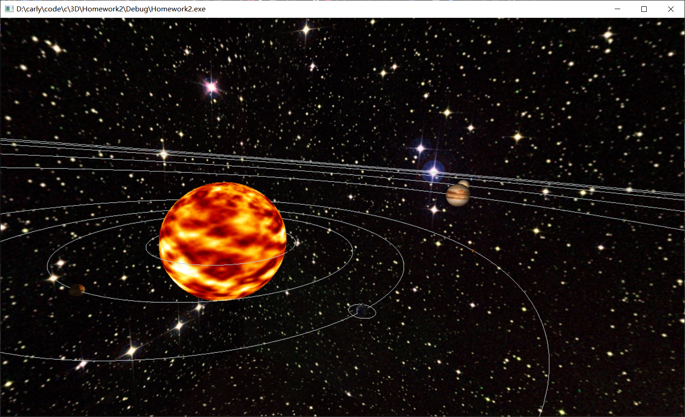

# homework2

## 作业要求

1. 光照，以太阳为光源
2. 纹理，使用图片进行纹理映射

### 选作要求

3. 使用顶点着色器和片段着色器，自己实现光照效果
4. 鼠标选择，点击不同球体显示不同名称

## 完成情况

实现以上要求，实现太阳系模型模拟
使用cmake链接库的方式配置opengl环境  
采用核心模式完成程序编写任务

## 其他说明

**操作**：键盘wasd控制相机位置参数，键盘ijkl控制相机旋转参数，键盘o控制星系轨道的出现与消失 
**目录结构**：debug目录下包含有可执行文件，include文件夹下为使用的头文件，lib目录下为使用的库文件，img目录下为纹理  
**参考**：部分代码学习自learnopengl

## 截图如下

