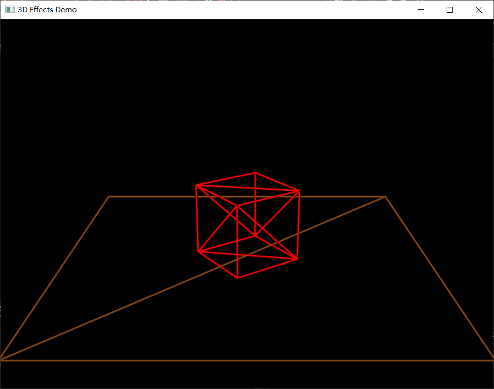

# homework1

## 作业要求

1. 使用glfw和glew或其他框架搭建OpenGL基本框架
2. 实现基本模型绘制 绘制立方体、圆球或者茶壶 
3. 实现相机控制 支持从不同视角和距离观察模型

## 完成情况

上述要求均已完成，绘制了一个可旋转的立方体  
使用cmake链接库的方式配置opengl环境  
采用核心模式完成程序编写任务

## 其他说明

**操作**：使用鼠标控制相机视角转动，键盘wasd控制相机位置，滑轮控制缩放，esc退出  
**目录结构**：Debug目录下包含有可执行文件，Block目录下是相关资源文件 
**参考**：部分代码学习自learnopengl以及网上相关教程

## 截图如下

