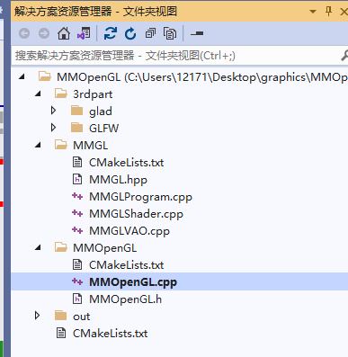
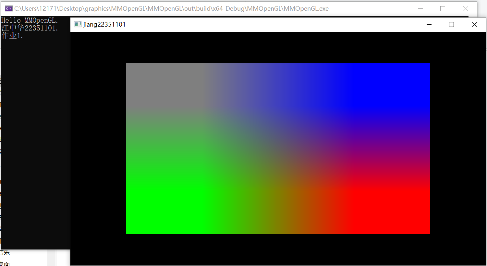
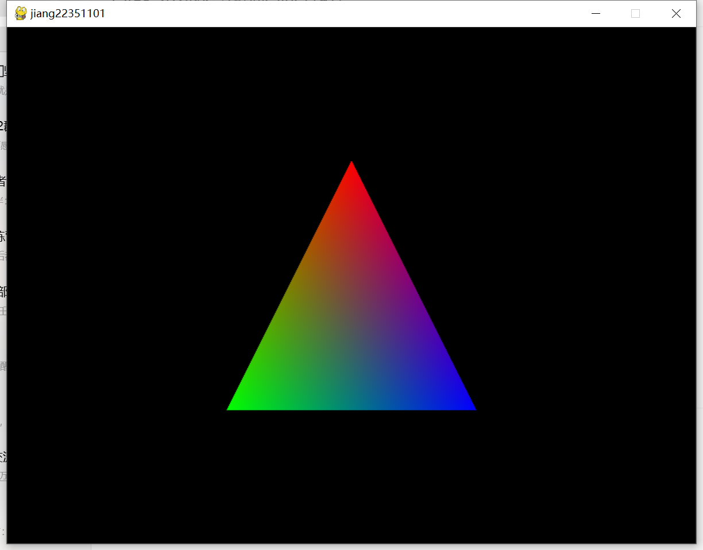
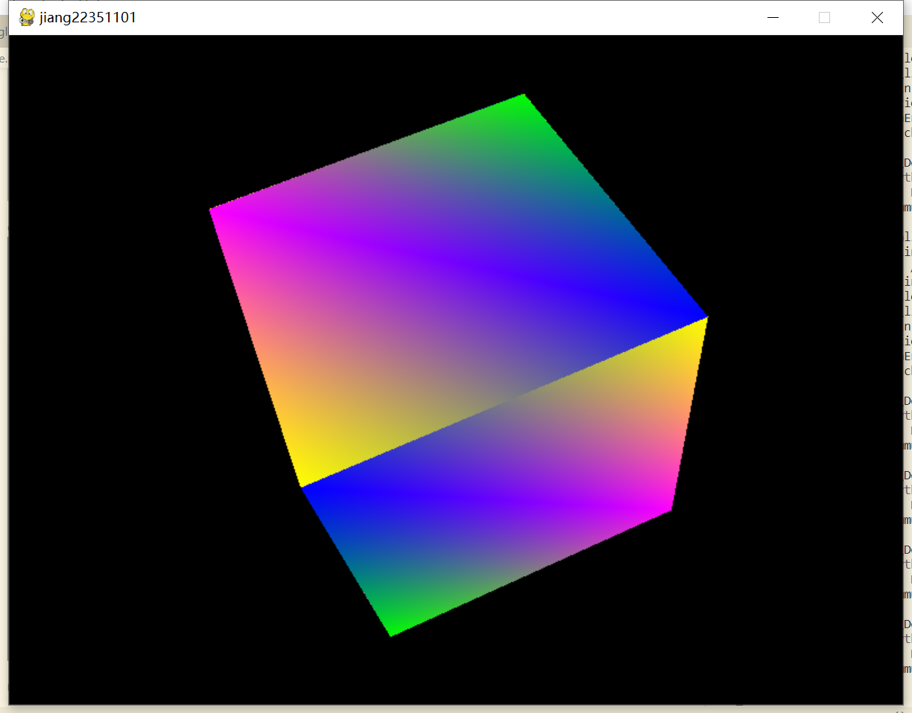

# 作业1
> **江中华 22351101**

### OpenGL

程序入口MMOpenGL.cpp 和 运行结果：

 

### pyOpenGL

运行结果：

 

 

### 参考资料

[1] [OpenGL 从入门到成魔 - Redknot-乔红 - 哔哩哔哩](https://space.bilibili.com/38154792/channel/seriesdetail?sid=1471599)

[2] [一小时实践入门 OpenGL - Native8418的文章 - 知乎](https://zhuanlan.zhihu.com/p/644395075)

