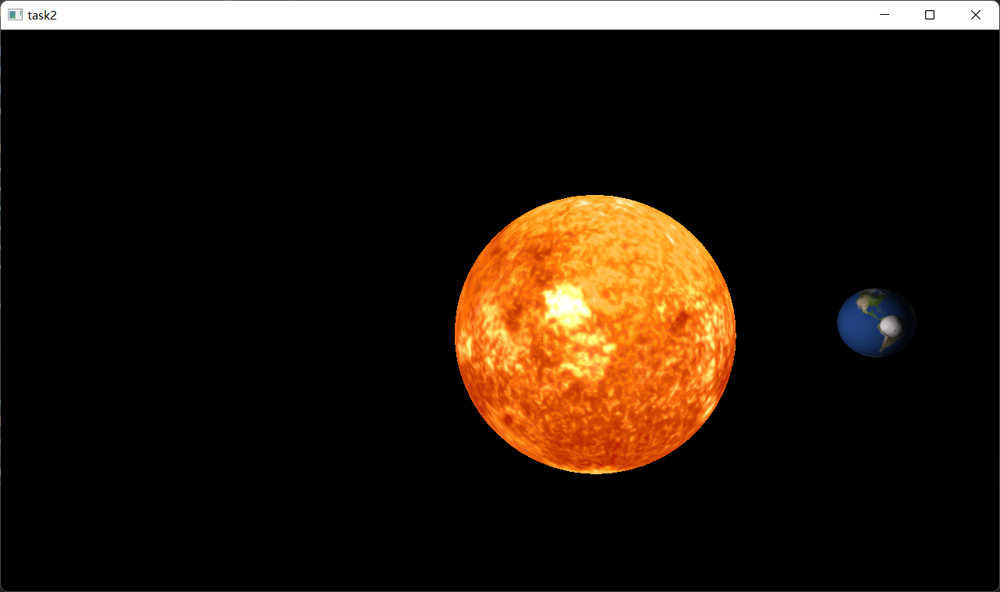

# homework2

## 作业要求

1. 光照，以太阳为光源
2. 纹理，使用图片进行纹理映射

### 选作要求

3. 使用顶点着色器和片段着色器，自己实现光照效果
4. 鼠标选择，点击不同球体显示不同名称

## 完成情况

实现要求1，2，3，绘制了地月日系统，重写shader实现漫反射和环境光照，光源为太阳  
使用cmake链接库的方式配置opengl（glfw+glad,同时使用glm作为矩阵向量计算库）环境  
采用核心模式完成程序编写任务

## 其他说明

**操作**：使用鼠标控制相机视角转动，键盘wasd控制相机位置，滑轮控制缩放，esc退出 
**目录结构**：debug目录下包含有可执行文件，include文件夹下为使用的头文件，lib目录下为使用的库文件，shader目录下是我使用的shader代码，img目录下为纹理  
**参考**：部分代码学习自learnopengl
**素材使用**：星球表面素材来源于https://www.solarsystemscope.com/ ，并使用开源库stb_image加载图像

## 截图如下

