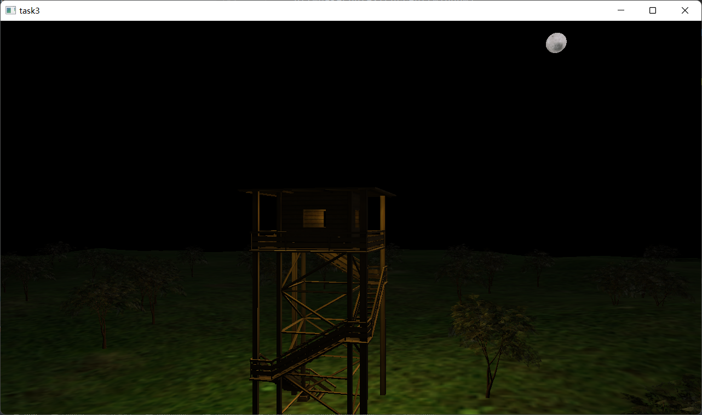

# homework3

## 作业要求

1. 支持三维模型显示、至少一种（STL、OBJ、3DS）
2. 支持多个光源的光照效果，使用着色器渲染
3. 支持多种视点浏览方式（以模型为中心的平移旋转和缩放，以视点为中心的场景漫游）

## 完成情况

实现要求1，2，3，绘制了一个森林塔楼场景，场景中使用了一个点光源和一个定向光源，使用assimp（使用mingw编译）导入OBJ格式3D素材  
使用cmake链接库的方式配置opengl（glfw+glad,同时使用glm作为矩阵向量计算库）环境  
采用核心模式完成程序编写任务  

## 其他说明

**操作**：使用鼠标控制相机视角转动，键盘wasd控制相机位置，q,e控制摄像机升降，滑轮控制缩放，esc退出  
使用z可以切换到模型中心模式（再次按下返回漫游），重置相机位置，并禁用wasd移动和视角转动（其余操作仍可以进行）。此时u、i控制塔楼旋转。o、p控制塔楼缩放，jklbnm控制塔楼沿坐标轴移动  
**目录结构**：debug目录下包含有可执行文件，include文件夹下为使用的头文件，lib目录下为使用的库文件，shader目录下是我使用的shader代码，img目录下为纹理，model目录下包含了使用的模型  
**参考**：部分代码学习自learnopengl
**素材使用**：3D模型来自<https://free3d.com/> 开源模型

## 截图如下

## 备注

在本次作业中，解决只能使用绝对路径的问题，现在可用相对路径访问资源。  
因gitignore设置原因，无法上传obj模型文件，同时库文件也无法上传。
