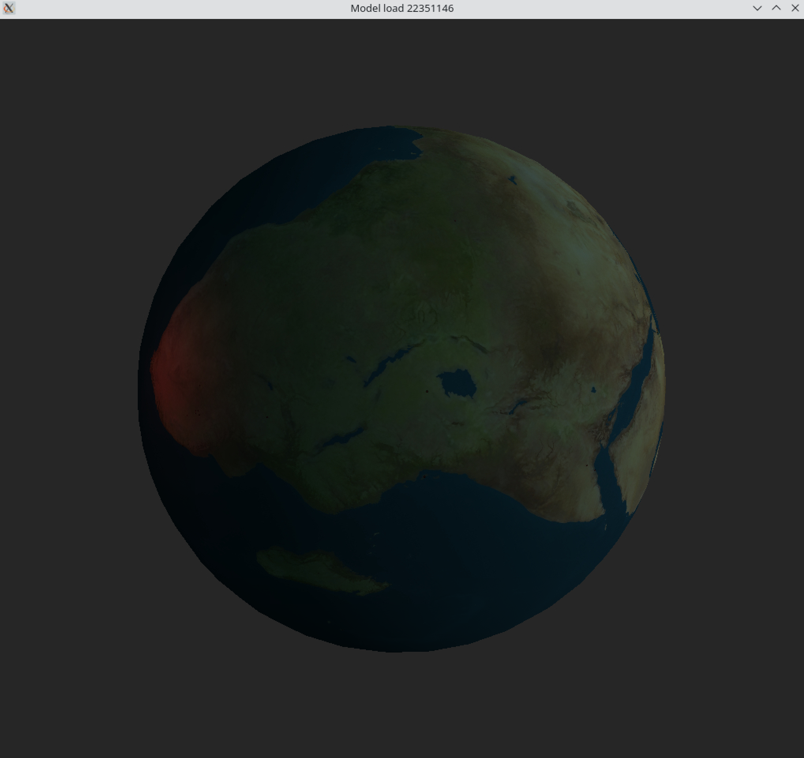
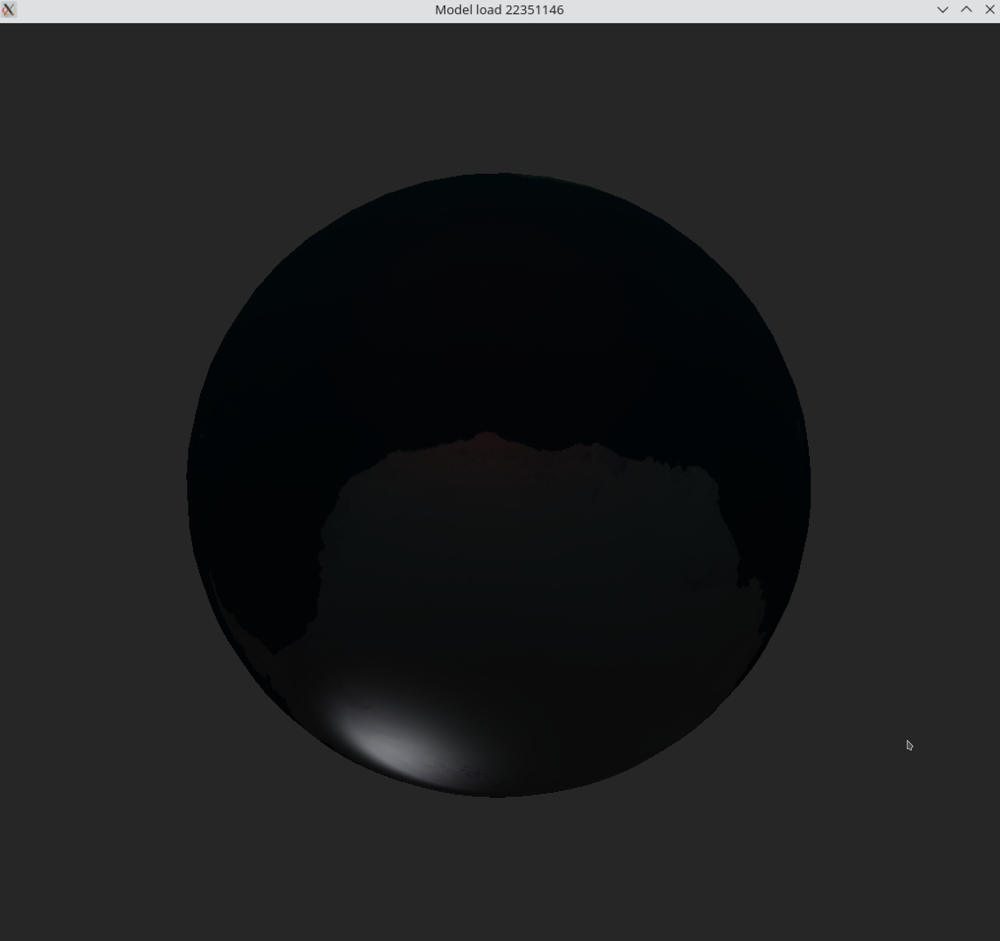

# HW3

## Description
This project utilizes GLFW and OpenGL to load and render a 3D model. The model is loaded from a .obj file and the texture is loaded from a .png file. The model can be rotated using the mouse and the camera can be moved using the WASD keys.

## Compilation
1. Ensure GLFW, OpenGL, GLM, Assimp and STB-image development environments are installed on your system.
2. Navigate to the project directory.
3. Run the `make` command in the terminal to compile the project.

## Preview

