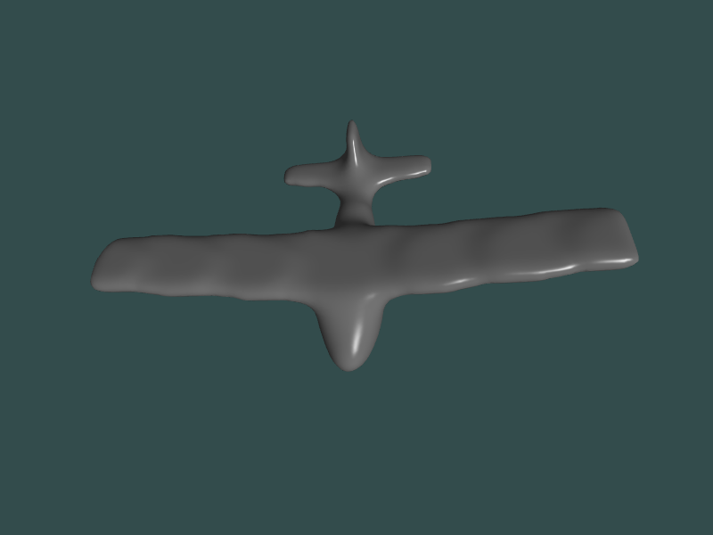

# Project3 of 2023 Zju Animation course
* 支持读取airplane.obj。
* 支持点光源和平行光照效果。
* 物体在自身坐标系上的移动：
  * U沿X轴正向移动，J沿X轴负向移动。
  * I沿Y轴正向移动，K沿Y轴负向移动。
  * O沿Z轴正向移动，L沿Z轴负向移动。
* 物体在自身坐标系上的旋转：
  * R沿X轴正向旋转，F沿X轴负向旋转。
  * T沿Y轴正向旋转，G沿Y轴负向旋转。
  * Y沿Z轴正向旋转，H沿Z轴负向旋转。
* 物体在自身坐标系上的缩放：
  * N放大，M缩小。
* 全局摄像机在全局坐标上的场景漫游：
  * WASD移动，鼠标移动控制旋转，鼠标滚轮控制缩放。

window snapshot:

