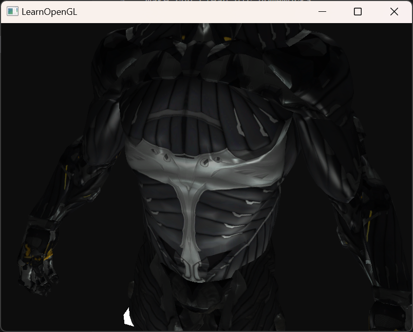
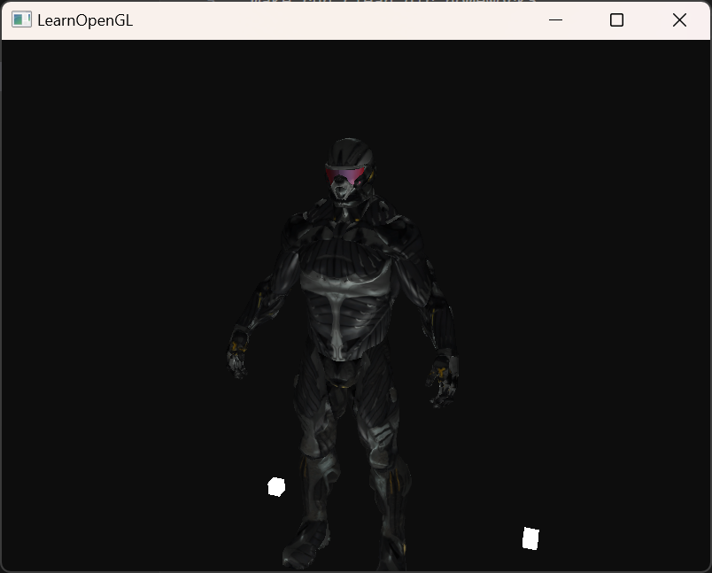
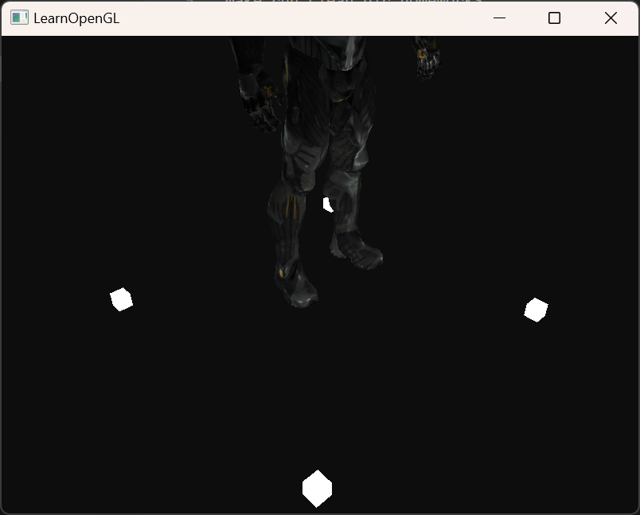

# 第三次作业：复杂三维模型显示
## 运行

```
make run clean dir=homework3
```
基于Open Asset Import Library库，此代码支持obj、3dx等三维模型文件格式读入。运行后通过键盘WASD和鼠标控制视角、移动和缩放，可以看到三种光源的光照效果：聚光、平行光和点光源，如下图所示。

<p float="left">
   
   
  
</p>

